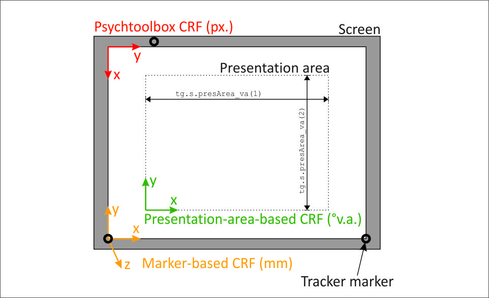
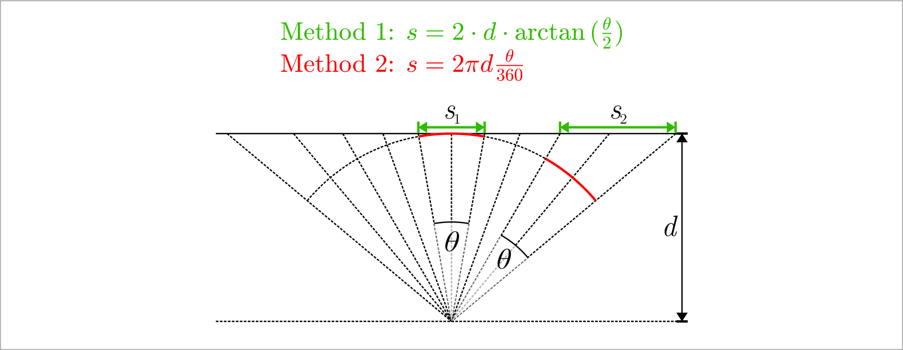
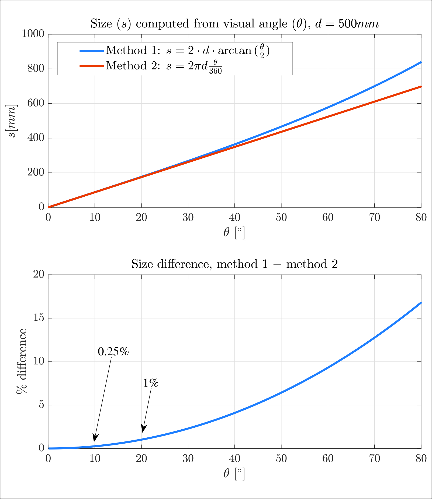

*__STATUS NOTE:__ This code is work in progress. The code has two major components:
trial generation and experiment code. Here's the status of each:*
* *Experiment scripts are largely done and somewhat tested, but need some additional bug hunting.*
* *Trial generation works but is not well structured/documented and does not implement all trial types, yet.*

*AS TO THE DOCUMENTATION BELOW: This has been carried over from a specific experiment and needs to be adjusted.*


# IC pointing task

Experimental task to examine illusory conjunctions though motion tracking, using
MATLAB, Psychtoolbox, and PTI Phoenix Visualeyez 3D Motion Trackers.

While this code implements a specific paradigm, it is designed in a way that
(hopefully) makes it quick and simple to implement other paradigms on its basis
while benefitting from the existing infrastructure.

The general idea is that functions and files in the private folder should not need to
be touched. Many of them make sense for most experiments - they can be used (or not)
as is. Paradigm-specific modifications should be necessary only to the m-files in the
`experiment` directory, namely:

* `main.m`, e.g. to add settings or present things before or
after all trials are completed.

* `openPTBWindows.m`, to specify (or remove) offscreen Psychtoolbox windows that can
then be used in the scripts below.

* `drawStimuli.m`, which draws stimuli to offscreen windows to be used in the
following script.

* `singleTrial.m`, to specify the sequence of events in each trial and to specify
which variables should be stored in the results file.


## Input to the experiment: Trial list and settings

When `main.m` is run, it asks for a trials file. It is generally up to you to 
construct this file, depending on your paradigm. It must however contain a struct
`tg`, which is expected to specify general settings for the experiment as well as
a list of trials and trial properties. It is mandatory that `tg` has the following
(sub-)fields:

* `tg.s`, where 's' stand for 'settings'. Each of its sub-fields specifies one
setting. An example would be the maximum allowed response time `tg.s.allowedTgtResponseTime`.
See `trialGeneration.m` (work in progress!) for a list of settings currently used. 
Other paradigms might use similar attributes but modifications will of course be 
necessary.

* `tg.triallist`, which contains the trial list in the form of a matrix. Each row
corresponds to one trial, and each column to one trial property (such as trial ID,
condition, stimulus positions, etc.). Trials will be presented in that list order
(although it can be specified that trials that were aborted before completion 
for some reason should be redone later and shuffled into the remaining trial list).

* `tg.s.triallistCols`, a special sub-field of `tg.s` that allows to address the 
columns of `tg.triallist` "by name" instead of hard-coding column indices. See
explanation [here](#column-index-structs).

These objects and fields need to be created during trial generation as required by
your paradigm.

#### Units

Data in `tg` is generally in degrees of visual angle, apart from a few values
where this does not make sense and which are instead in millimeters. The
fieldnames of these are postfixed '_mm'. The origin of the reference frame
is generally located at the lower left corner of the "presentation area", a
rectangular region centered within the screen, x-axis increases rightward,
y-axis upward; see [below](#spatial-reference-frames-and-units) for more info on spatial
reference frames.

#### Further notes on settings

Most experimental settings are defined already during trial
generation (in `tg.s`) rather than in the experimental script. The idea 
is to ensure that once trials have been generated and saved, experiment
settings cannot be modified accidentally halfway through participants.

The few things that are set in the experimental script itself (as well
stored in 'e.s') are specific properties of the hardware used or the spatial
arrangement, such as screen size or viewing distance of the participant.
Setting these in the experimental script allows things like switching to
a screen of a different size halfway through participants, since the actual
sizes of stimuli on the screen as well as other spatial values
are computed dynamically in the experimental script based on the
settings there, so that all distances and sizes will automatically
adhere to the desired visual angles specified in `tg.triallist`.

Note that in each trial the current row from `tg.triallist` will be stored 
in the results matrix along with the actual results. Also, all
fields of `tg.s.` will be copied to the experimental output struct (see below),
namely to its field `e.s`, so that trial files won't be needed at all after
the experiment. (The only field that is not copied is `tg.s.triallistCols`,
which as explained below is instead integrated with the column-index struct
for the results matrix, `e.s.resCols`)


## Output of the experiment: Results matrix, trajectories, and settings

The output file produced by the experimental script contains a struct
`e` that holds all settings and results. It has the following (sub-)fields:

* `e.results`, a matrix where each row is one trial that was presented
(in presentation order) and columns are properties of the participant's
responses or trial properties. Note that incomplete trials that were 
aborted for some reason are stilll recorded in the matrix, so that the
final order is not necessarily identical to that of `tg.triallist`. Trial
properties in `e-results` are transferred from `tg.triallist`, though,
so that all required information is present and `tg.triallist` is not
needed anymore. Aborted trials are furthermore marked in the column
addressed by `e.s.resCols.abortCode` (see below) using the codes specified
[here](#Trial-abortion-and-abort-codes).

* `e.s.resCols` a special sub-field of `e.s` that allows to address the 
columns of `e.results` "by name" instead of hard-coding column indices.
See explanation [here](#column-index-structs). `e.s.resCols` is automatically
created based on the variables defined as output of the experiment (as described
[here](#specifying-which-variables-should-be-stored-in-the-results-matrix))

* `e.s`, a struct with various fields that hold __all__ non-trial-specific
settings used for the experiment. This includes copies of all fields from
'tg.s' (except 'triallistCols', which is integrated with `e.s.resCols` instead), 
so that `tg` is not needed for analysis.

* `e.trajectories`, a cell array. Each cell holds one trajectory in the form 
of a matrix, where columns correspond to spatial positions and time stamps
as specified in `e.s.trajCols`. The order of cells corresponds to the order
of rows in `e.results`, meaning that each trajectory corresponds to one of
those rows. If a trial was aborted before trajectory recording started, the
matrix will be empty. If the trial was aborted during trajectory recording, 
the trajectory will be incomplete. Note that similar result objects that do 
not lend themselves to be stored in the results matrix could be stored in a
similar manner by adjusting the code accordingly. For paradigms where no
such objects are needed (e.g., without trajectory recording), the respective
code should be easy to spot and remove.

#### Units

Data in `e.results` and values in `e.s` are generally in degrees of visual angle,
apart from a few values where this does not make sense and which are instead in 
millimeters. The fieldnames of these are postfixed '_mm'. Trajectory data
(`e.trajectories`) as well is in millimeters, since visual angle is difficult to
map onto 3D data. However, the origin of the reference frame is generally located
at the lower left corner of the "presentation area", a rectangular region centered
within the screen, x-axis increases rightward, y-axis upward; see
[below](#spatial-reference-frames-and-units) for more info on spatial reference frames.

## Specifying which variables should be stored in the results matrix

##### Short version

Everything written to fields of struct `out` during trials will
automatically be stored it in the results matrix ('e.results'). Add or remove
fields to/from `out` as needed, but assign only integers or column vectors.
Columns of the results matrix can later be addressed "by name" using
column indices in fields of 'e.s.resCols'. 

##### Detailed version

An empty struct `out` is created/reset before each trial. Fields
can be created in this struct as needed during the trial (preferably
within `singleTrial.m`). A column vector or an integer should be written
to each field (say, a response time). When the trial ends, the
objects stored in the fields of 'out' will be transformed into a
row of results values and this row is written to the results
matrix (`e.results`).

Note that 'e.s.resCols' (see [below](#column-index-structs)) is
automatically created based on the contents of `out`. The fields of
`e.s.resCols` are named after the fields that exist in `out` at the
end of a trial. 

If the value of a field of `out` is a column vector then its elements
will be written to the results matrix in consecutive columns and
`e.s.resCols` will have two fields for this object, one to address into the
first column of the span of columns, the other addressing into the last
one (so that together they can be used to retrieve the full span of values).
The two fields of `e.s.resCols` have the same name as the respective
field of 'out' except for being postfixed with 'Start' and 'End', respectively.

It is possible to add fields to `out` that were not used in earlier trials,
in which case rows in `e.results` from preceding trials will be filled with
nans in these columns. Note however that once a field in `out` has been used,
the objects stored in it must be of the same size in each trial (pad with nans
if needed).


## Column-index structs

Column-index structs are used in multiple places in this codes, in order
to be able to address into columns of often-used target matrices "by name"
instead of having to hard-code or remember what data is stored in which column.
Examples are `e.s.resCols` (for `e.results`) and `tg.s.triallistCols`
(for `tg.triallist`). Each column-index struct has multiple fields, and 
each field holds an integer that refers to a column of the target matrix.
For instance: 

```matlab
>> e.s.resCols.responseCorrect

e.s.resCols.responseCorrect = 12  
                                  
>> % correctness is stored in column 12 of e.results,
>> % so we can get the correctness for the tenth trial
>> % like this:
>>
>> e.results(10, e.s.resCols.responseCorrect)

e.results(10, e.s.resCols.responseCorrect) = 1
````

Some field names of column-index structs are postfixed with 'Start' or
'End', such as `e.s.triallistCols.shapesStart` and `tg.s.triallistCols.shapesEnd`.
These refer to a span of columns in the matrix. Such spans can be addressed like this:

```matlab
>> tg.s.triallistCols.shapesStart

tg.s.triallistCols.shapesStart = 12  
                                  
>> tg.s.triallistCols.shapesEnd

tg.s.triallistCols.shapesStart = 15

>> % Shapes seem to be stored in columns 12 to 15,
>> % so we can get all shape codes for tiral 10 like this:
>>
>> tg.triallist(10, tg.s.triallistCols.shapesStart:tg.s.triallistCols.shapesEnd)

tg.triallist(10, tg.s.triallistCols.shapesStart:tg.s.triallistCols.shapesEnd) = 
    1     2     3     4
````

If different such spans refer to similar entities (e.g., the horizontal
positions of stimuli and the vertical positions of stimuli), then the order
of entities within the span is (and should be ensured to be) identical in
all cases.


## Spatial reference frames and units



#### Short version

All input and output to and from the experimental script are in the
presentation-area-based frame and in degrees visual angle *except for
trajectory data* (which is in the same frame but in millimeters) and very
few settings that make sense only in millimeters (like physical screen
size; these are postfixed '_mm') or pixels (like screen resolution;
postfixed '_px'). 

#### Detailed version

There are three coordinate reference frames (CRF) used here (see figure above).
Although in most cases you only need to think about the first one (unless you
modify lower-level code).

* *__Presentation-area-based frame (pa):__* Used for all input to and output
from the experimental script, that is, in trial generation (struct 'tg' loaded from
trial file) and for results output (`e.results`). The origin is at the
bottom left of the presentation area (rectangular area whose size is defined
in `tg.presArea_va` and which is inset in and centered within the screen),
x-axis increases to the right, y-axis increases upward. Units used in
conjunction with this frame are degrees of visual angle (va), except for
very few exceptions, which are:  
    * Trajectory data (`e.trajectories`), which uses this frame but is in
millimeters (as visual angle does not make much sense for 3D data). The
positive z-axis extends toward the viewer and is orthogonal to the
screen surface.  
    * A few settings that make sense only in millimeters; these settings are
clearly marked by the postfix '_mm' in the fieldnames of `e.s`.

* *__Psychtoolbox frame (ptb):__* Used *only* in the internals of the trial
script (`singleTrial.m`) when drawing things to the screen via Psychtoolbox.
The origin is at the top left of the screen, x-axis increasing to the right,
y-axis increasing downward. Units used in conjunction with this frame are pixels.

* *__Screen-marker-based frame (scr):__* Relevant only when dealing with
motion tracker data. This is the frame in which pointer position is obtained
from function `getTip_pa` (see private folder) during the experiment.
(Apart from a prespecified offset, as explained below) its origin is at
the position of the marker mounted at the lower left of the screen's
visible image area, its positive x-axis points in the direction
of the marker mounted at the lower right corner of the visible image
area, the positive x-y-plane is defined by the marker on the top border
of the visible image (at a positive x-value). The z-axis extends toward
the viewer. As hinted above, this frame (i.e., what is obtained from
`getTip_pa`) is offset in x/y/z direction by the three-element vector in
`e.s.markerCRFoffset_xyz_mm`, the main use of which is to shift the
x-y-plane(z=0) right onto the screen surface despite marker diodes being
mounted somewhat above the screen surface.


#### Functions for CRF and unit conversion

The private folder contains functions that allow converting between the
different reference frames, by passing the values to be converted 
plus the struct `e.s.spatialConfig` (which is created at the outset of the
experimental script and holds all relevant information about the spatial
setup, such as viewing distance, screen extent etc).

All of these functions follow the same naming scheme (see the individual
functions' documentations for more info). Naming examples:

* `paVaToPtbPx()`: convert from presentation-area-based frame (pa) in 
degrees visual angle (va) to Psychtoolbox frame (ptb) in pixels (px).

* `scrMmToPaMm()`: convert from screen-marker-based frame (scr) in
millimeters (mm) to presentation-area-based frame (pa) in millimeters (mm).

* `pxToMm()`: convert from pixels (px) to millimeters (mm).

Since `e.s.spatialConfig` is stored with the results data, these functions
can also be used during later analysis.

#### Note: Visual angle conversion

The method that most psychophysics people use to convert between visual angle and
sizes or distances on a flat screen is Method 1 in the figure below (where d is
viewing distance, s is stimulus size or distance, and theta is the visual angle in
degrees). With this method, stimulus sizes or distances depend on eccentricity, as
can be seen from the different lengths of the green lines in the figure. With this
method it is sometimes not clear when people provide stimulus sizes or distances
whether they computed them as if the stimulus was in the center of vision, or whether
they accounted for its eccentricity (which in most cases does not seem to be the case). 

In the code, I instead use Method 2, which computes size or distance s as the
length of the arc with radius d that corresponds to theta. As can be seen from
the red lines in the figure, there is a constant relationship between
angle and size with this method. I use this method instead of the standard one to
be able to use visual angle as units in the coordinate system in which stimuli
locations and sizes are defined. This works only if the relationship is consistent.

Of course, the results of the two methods differ somewhat, and this difference
increases with the visual angle or stimulus size at hand. However, for all practical
stimulus sizes and distances that may occur in experiments that you would implement
using this code, this difference between the methods is negligibly small (which may be
one reason why people do not bother stating whether or not they accounted for eccentricity).
The bottom figure shows the difference for different values of visual angle, to help
decide whether the difference is relevant for the experiment at hand.






## Conditions, responses and codes

Conditions, responses, esponse types and codes used in `e.results`,
plus corresponding field names in `e.s.resCols`:

| Trial type (.trialType)    | Present response (.tgtPresentResponse)  | Response type (.responseType) |
| ------------- |:-------------:| -----:|
|tgt present (1) | tgt present (1) | hit                  (1)
|tgt present (1) | tgt absent  (0) | miss                 (2)
|both present(2) | tgt present (1) | illusory conjunction (3)
|both present(2) | tgt absent  (0) | correct rejection BP (4)
|color only  (3) | tgt present (1) | feature error        (5)
|color only  (3) | tgt absent  (0) | correct rejection CO (6)


## Trial abortion and abort codes

Trials may be aborted before completion due to various reasons. Any data
pertaining to aborted trials will nonetheless be stored in `e.results`,
including an abort code (column number is `e.s.resCols.abortCode`) giving
the reason for abortion. These are:

|Code|Meaning
|---|:---:
| 0 |  trial completed
| 1 |  not moved to starting position in time
| 2 |  moved off starting position during fixation phase
| 3 |  moved off starting position during stimulus presentation
| 4 |  exceeded max RT for location response
| 5 |  exceeded max RT for target presence response

Any missing results values for prematurely aborted trials (e.g., response
correctness) will be nan in `e.results` and cells in `e.trajectories` will
contain an empty matrix if recording has not started yet (if abortion
instead occurs during recording, an incomplete trajectory will be stored).


