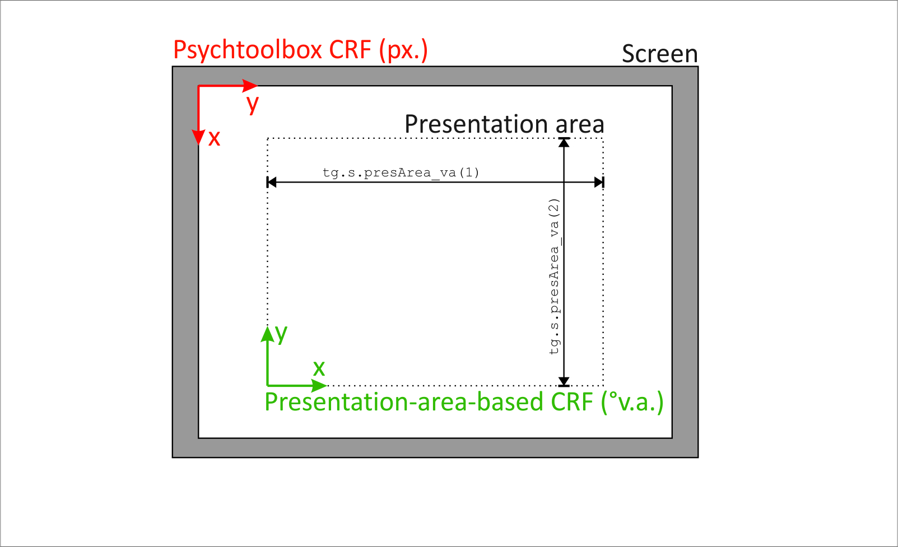
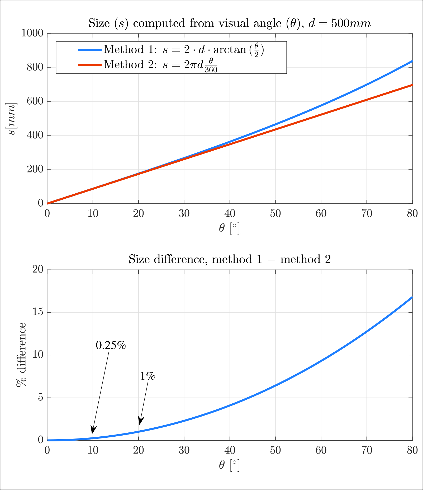

*__STATUS NOTE:__ This code is work in progress. The code has two major components:
trial generation and experiment code. Here's the status of each:*
* *Experiment scripts are done, documented, and tested to some extent.* 
* *Trial generation works but could use some coherent documentation.*

*In addition to the basic docs below, each modifiable code file itself contains relatively detailed instructions on how to use it.*

# TODO
- mouse stuff documentation... new anonymous function getMouseRM...
- Motion tracking input (later... after Coras experiment)

# Presentation area

The presentation area is an imagined rectangle centered within the screen.
Its side lengths are set in degrees of visual angle during trial
generation, through 'tg.s.presArea_va'. For instance:

tg.s.presArea_va = [20, 10];    % [horizontal, vertical] 

It serves as a coordinate frame in which stimulus positions should be
defined during trial generation. The origin is at the bottom left
corner, the positive x-axis points to the right and the positive
y-axis points upward. Degrees of visual angle should be used as units.

Using the presentation area as coordinate frame means that stimuli
positions are defined relative to the screen center rather than in 
relation to screen borders, making stimulus positioning independent from
screen size. Thus, different screens can easily be used for the same 
experiment while keeping stimulus positions constant. The only thing
that needs to be adjusted when switching screens is the physical screen
size ('e.s.expScreenSize_mm' in generalSettings.m).

If the field 'presArea_va' is not defined during trial generation, the
default [0,0] will be used. This means that the coordinate origin for
stimulus definition will be in the screen center, which should be
convenient in most cases. 

# Rough trial generation overview


1) Define settings as fields of 'tg.s'; these apply to whole experiment
   - built-in optional settings, see Readme.md, in short:
   - custom settings (not trial-specific)
   - define tg.s.triallistCols MANDATORY

2) Make trial list (tg.triallist)
   - Each trial one row. 
   - This is the info that you will use in the experiment script to
     customize each trial (in files named 's5*.m' in folder
     paradigmDefinition.m)
   - Suggestion: include unique ID

3) Save (maybe do that automaitcally?)


# Optional settings during trial generation

--- tg.s.useTrialBlocks

Boolean, default if undefined: false. If set to true, trials are blocked.
This allows implementing pauses for the participants or running other code
between blocks. In detail, if 'tg.s.useTrialBlocks' is true:

Each trial in 'tg.triallist' must be marked as belonging to one block. For
this, define 'tg.s.triallistCols.block' and assign to it the number of a
column of the trial list ('tg.triallist'). This column must contain integers
that identify the block number for each trial. Arbitrary integers may be
used but each block must have a unique number and all trials with the same
number must be in consecutive rows (else an error will be thrown).                                                                    

Any code in 's5a_blockBreak.m' (folder 'paradigmDefinition') will be
executed before each block but the first one. Optionally, this can be
further controlled by defining 'tg.s.breakBeforeBlockNumbers' and assigning
to it an array of block numbers. 's5a_blockBreak.m' will then be executed
only before the specified blocks (which may include the first one).

Trial shuffling will occur only within and not across blocks (see
'tg.s.shuffleTrialOrder'), that is, block order is preserved.

--- tg.s.shuffleTrialOrder
  
Boolean, default if undefined: false. If set to true, the order of trials
in the triallist will be shuffled at the outset of the experimental script,
so that each participant will see a different trial order. If blocks are
used (see 'tg.s.useTrialBlocks'), shuffling will occur only within blocks.     
                                          
--- tg.s.shuffleBlockOrder             
                                       
Boolean, default if undefined: false. If set to true, the order of blocks
in the triallist will be shuffled at the outset of the experimental script,
so that each participant will see a different block order. Obviously, this
only comes to effect if blocks are used (see 'tg.s.useTrialBlocks').


# TriallistCols and similar (integrate with existing col structs doc)

% Fields and number of columns for tg.s.triallistCols (struct holding column
% indices of trial matrix). 

tg.s.triallistCols.trialID = 1;
tg.s.triallistCols.block = 2;
tg.s.triallistCols.tgt = 2;
tg.s.triallistCols.horzPos = 3:5; 
tg.s.triallistCols.vertPos = 6:8;

% Say you have three stimulus items in each display. To get the horizontal
% positions of all items in, say, trial 10, do:

horzPosAll = tg.triallist(10, tg.s.triallistCols.horzPos);

% Now say in each trial one of the three stimuls items plays a special
% role, for instance as a target item. In each trial you use a the column
% number 'tg.s.triallistCols.tgt' to store which of the three items is the
% target. So to get the horizontal position of the target item in a given
% trial, say 20, do:

% get which of the three items is the target item in trial 20
tgtItemNumber = tg.triallist(20, tg.s.triallistCols.tgt);
% then combine that info with the column numbers for horizontal positions
% to retrieve the target items' horizontal position.
horzPosTgt = tg.triallist(20, tg.s.triallistCols.horzPos(tgtItemNumber));

% The names (triallist, triallistCols, resCols) are admittedly a little
% cumbersome, which represents a tradeoff against accessibility. Rename the
% variables yourself when working with, to arrive at less code.

% Temporary rename
tl = tg.triallist;
tCols = tg.s.triallistCols;

% This is the same as the entire previous example:
horzPosTgt = tl(20, tCols.horzPos(tl(20, tCols.tgt)));


# Psychophysics experiment template using MATLAB & Psychtoolbox 3

This template is designed to speed up the development of psychophsics experiments
with MATLAB and Psychtoolbox 3. It handles some common aspects of experiment scripts,
such as loading a list of trials, reading data from it, presenting instructions, 
iterating over trials, generating and saving a matrix of results, and converting between 
different spatial reference frames and units (e.g., millimeters, degrees of visual angle,
and pixels).

What you still have to do is creating the list of trials as needed for your experiment
(you can do that in `trial_generation.m`), define experiment-specific settings, draw
your stimuli, and specify which variables should be stored in the result file (you can do
all of that in the files in the `experiment` folder; start with `main.m`).

The general idea is that you should usually only modify the files located
in the `experiment` and `trial_generation` top folders.  Functions and files in
the private and `common_functions` folders should not need to be touched, although 
it can't hurt to take a look at them since they might be useful for your experiment
as well. 

Note that there is also extensive documentation in the code files themselves. Also note that
there's a working example experiment packaged with the code which uses the template code
and should give a pretty good idea how to go about implementing your own experiment.

## Input to the experiment: Trial list and settings

When `main.m` is run, it asks for a trials file. It is generally up to you to 
construct this file, depending on your paradigm. It must however contain a struct
`tg`, which is expected to specify general settings for the experiment as well as
a list of trials and trial properties. There are some mandatory fields in this
struct, of which I explain the most important ones here. There are a few others, 
though, which are listed in `trial_generation.m`.

* `tg.s`, where 's' stands for 'settings'. Each of its sub-fields specifies one
setting. An example would be the maximum allowed response time `tg.s.allowedTgtResponseTime`.
This should only be settings that are relevant across trials.

* `tg.triallist`, which contains the trial list in the form of a matrix. Each row
corresponds to one trial, and each column to one trial property (such as trial ID,
condition, stimulus positions, etc.). Trials will be presented in that list order
(although it can be specified that trials that were aborted before completion 
for some reason should be redone later and shuffled into the remaining trial list,
which will modify this order).

* `tg.s.triallistCols`, a special sub-field of `tg.s` that allows to address the 
columns of `tg.triallist` "by name" instead of hard-coding column indices. See
explanation [here](#column-index-structs).

* `tg.s.presArea_va`, a two-element row vector that specifies the extent of the
presentation area (see next section) in degrees of visual angle.

#### Units

One concept used in the scripts is that of a "presentation area". This is a rectangular
area whose extent is specified during trial generation in `tg.s.presArea_va`
(in degrees visual angle). It will automatically be centered within the screen used
to present the experiment and its actual size (e.g., in millimeters) will depend 
on the viewing distance of the participant (which is specified at the outset of the
experimental script `main.m`). Thus, it will always be of the same size with respect
to visual angle, allowing to present the experiment on different screens and at 
different viewing distances.

For this to work, settings, positions and sizes of visual items specified during
trial generation should be given in degrees visual angle (as far as that makes sense)
and within a reference frame that is relative to the presentation area.
This frame's origin is located at the lower left corner of the "presentation area", a
rectangular region centered within the screen, x-axis increases rightward,
y-axis upward; see [below](#spatial-reference-frames-and-units) for more info on spatial
reference frames. When drawing things in the experimental script, use the conversion
functions in the `common_functions` folder to convert from that reference frame
to the frame used by Psychtoolbox.

#### Further notes on settings

Most experimental settings are defined already during trial
generation (in `tg.s`) rather than in the experimental script. The idea 
is to ensure that once trials have been generated and saved, experiment
settings cannot be modified accidentally halfway through participants.

The few things that are set in the experimental script itself (as well
stored in `e.s`) are specific properties of the hardware used or the spatial
arrangement, such as screen size or viewing distance of the participant.
Setting these in the experimental script allows things like switching to
a screen of a different size halfway through participants, since the actual
sizes of stimuli on the screen as well as other spatial values
are computed dynamically in the experimental script based on the
settings there, so that all distances and sizes will automatically
adhere to the desired visual angles specified in `tg.triallist`.

## Output of the experiment: Results matrix, custom data, and settings

The idea here is that the experiment script takes a trial list as input and
uses the information internally, but outputs only one self-contained struct
`e` in the saved file so that the trial list or file won't be needed for analysis
anymore. 

Struct `e` will hold all settings and results. It has the following (sub-)fields:

* `e.results`, a matrix where each row is one trial that was presented
(in presentation order) and columns are properties of the participant's
responses or trial properties. Note that incomplete trials that were 
aborted for some reason are stilll recorded in the matrix, so that the
final order is not necessarily identical to that of `tg.triallist`. Trial
properties in `e.results` are transferred from `tg.triallist`, though,
so that all required information is present and `tg.triallist` is not
needed anymore.

* `e.s.resCols` a special sub-field of `e.s` that allows to address the 
columns of `e.results` "by name" instead of hard-coding column indices.
See explanation [here](#column-index-structs). `e.s.resCols` is automatically
created based on the variables defined as output of the experiment (as described
[here](#specifying-which-variables-should-be-stored-in-the-results-matrix))

* `e.s`, a struct with various fields that hold __all__ non-trial-specific
settings used for the experiment. This includes copies of all fields from
`tg.s` (except `triallistCols`, which is integrated with `e.s.resCols` instead), 
so that `tg` is not needed for analysis.

* Additional custom-defined fields of `e`. If some data you want to store
does not fit the results matrix (`e.results`), you can store that data in
additional fields of `e` that you may create as needed. See documentation in
`storeCustomOutputData.m`.

## Specifying which variables should be stored in the results matrix

##### Short version

Everything written to fields of struct `out` during trials will
automatically be stored it in the results matrix (`e.results`). Add or remove
fields to/from `out` as needed, but assign only integers or column vectors.
Columns of the results matrix can later be addressed "by name" using
column indices in fields of `e.s.resCols`. 

##### Detailed version

An empty struct `out` is created/reset before each trial. Fields
can be created in this struct as needed during the trial (preferably
within `runTrial.m`). A column vector or an integer should be written
to each field (say, a response time). When the trial ends, the
objects stored in the fields of `out` will be transformed into a
row of results values and this row is written to the results
matrix (`e.results`).

Note that `e.s.resCols` (see [below](#column-index-structs)) is
automatically created based on the contents of `out`. The fields of
`e.s.resCols` are named after the fields that exist in `out` at the
end of a trial. 

If the value of a field of `out` is a column vector then its elements
will be written to the results matrix in consecutive columns and
`e.s.resCols` will have two fields for this object, one to address into the
first column of the span of columns, the other addressing into the last
one (so that together they can be used to retrieve the full span of values).
The two fields of `e.s.resCols` have the same name as the respective
field of `out` except for being postfixed with 'Start' and 'End', respectively.

It is possible to add fields to `out` that were not used in earlier trials,
in which case rows in `e.results` from preceding trials will be filled with
nans in these columns. Note however that once a field in `out` has been established,
the objects stored in it must be of the same size in each trial (pad with nans
if needed).


## Column-index structs

Column-index structs are used in multiple places in the code, in order
to be able to address into columns of often-used target matrices "by name"
instead of having to hard-code or remember what data is stored in which column.
Examples are `e.s.resCols` (for `e.results`) and `tg.s.triallistCols`
(for `tg.triallist`). __Note that in the experiment script you can refer to 
`tg.s.triallistCols` simply by `triallistCols`.__ Each column-index struct has
multiple fields, and each field holds an integer that refers to a column of the
target matrix. For instance: 

```matlab
>> e.s.resCols.responseCorrect

e.s.resCols.responseCorrect = 12  
                                  
>> % correctness is stored in column 12 of e.results,
>> % so we can get the correctness for the tenth trial
>> % like this:
>>
>> e.results(10, e.s.resCols.responseCorrect)

e.results(10, e.s.resCols.responseCorrect) = 1
````

Some field names of column-index structs are postfixed with 'Start' or
'End', such as `e.s.triallistCols.shapesStart` and `tg.s.triallistCols.shapesEnd`.
These refer to a span of columns in the matrix. Such spans can be addressed like this:

```matlab
>> tg.s.triallistCols.shapesStart

tg.s.triallistCols.shapesStart = 12  
                                  
>> tg.s.triallistCols.shapesEnd

tg.s.triallistCols.shapesEnd = 15

>> % Shapes seem to be stored in columns 12 to 15,
>> % so we can get all shape codes for tiral 10 like this:
>>
>> tg.triallist(10, tg.s.triallistCols.shapesStart:tg.s.triallistCols.shapesEnd)

tg.triallist(10, tg.s.triallistCols.shapesStart:tg.s.triallistCols.shapesEnd) = 
    1     2     3     4
````

If different such spans refer to similar entities (e.g., the horizontal
positions of stimuli and the vertical positions of stimuli), then the order
of entities within the span should be ensured to be identical in
all cases, so that different types of values can later be attributed to
the matching item more easily.


## Spatial reference frames and units



#### Short version

All input and output to and from the experimental script should be in the
presentation-area-based frame and in degrees visual angle except for
settings that make sense only in millimeters (like physical screen
size; these are postfixed '\_mm') or pixels (like screen resolution;
postfixed '\_px'). When calling Psychtoolbox functions,
use conversion functions in `common_functions` to convert to the Psychtoolbox
frame.

#### Detailed version

There are two coordinate reference frames (CRF) relevant here (see figure above).
In most cases you really only need to think about the first one, as all positions
for drawing and similar things should be specified in that frame. The second one
is used by Psychtoolbox and only relevant when using Psychtoolbox functions. On top
of this, there are convenient conversion functions in the `common_functions` folder
that allow switching between frames easily.

* *__Presentation-area-based frame (pa):__* Should be used for all input to and
ideally also for output from the experimental script (although that is up to you)
, that is, in trial generation (struct `tg` loaded from trial file) and for
results output (`e.results`). The origin is at the bottom left of the presentation
area (rectangular area whose size is defined in `tg.presArea_va` and which is inset
in and centered within the screen), x-axis increases to the right, y-axis increases
upward. Units used in conjunction with this frame are degrees of visual angle (va),
except for a few settings that make sense only in millimeters or pixels; these
settings are clearly marked by the postfix '_mm' or '_px' in the fieldnames of `e.s`.

* *__Psychtoolbox frame (ptb):__* Used only in the internals of the experimental 
script and when drawing to Psychtoolbox-windows. The origin is at the top left of
the screen, x-axis increasing to the right, y-axis increasing downward. Units used
in conjunction with this frame are pixels. The Psychtoolbox drawing functions expect
data to be in this frame. Thus, when using Psychtoolbox functions, use conversion
functions (see next section) to convert any data to this frame first. Note that
Psychtoolbox output like mouse position from functions like `GetMouse` are also in
this frame. To map these back to other frames and/or units you can as well use
conversion functions.

#### Functions for CRF and unit conversion

The `common_functions` folder contains functions that allow converting between the
different reference frames, by passing the values to be converted 
plus the struct `e.s.spatialConfig` (which is created at the outset of the
experimental script and holds all relevant information about the spatial
setup, such as viewing distance, screen extent etc).

All of these functions follow the same naming scheme (see the individual
functions' documentations for more info). Naming examples:

* `paVaToPtbPx()`: convert from presentation-area-based frame (pa) in 
degrees visual angle (va) to Psychtoolbox frame (ptb) in pixels (px).

* `pxToMm()`: convert from pixels (px) to millimeters (mm).

Since `e.s.spatialConfig` is stored with the results data, these functions
can also be used during later analysis (so it does not restrict analysis if 
you initially save results data only in one frame).

#### Note: Visual angle conversion

The method to do calculations with visual angle used in the conversion functions is
slightly different from the standard way.

The method that most psychophysics people use to convert between visual angle and
sizes or distances on a flat screen is Method 1 in the figure below (where d is
viewing distance, s is stimulus size or distance, and theta is the visual angle in
degrees). With this method, stimulus sizes or distances depend on eccentricity, as
can be seen from the different lengths of the green lines in the figure. With this
method it is sometimes not clear when people provide stimulus sizes or distances
whether they computed them as if the stimulus was in the center of vision, or whether
they accounted for its eccentricity (which in most cases does not seem to be the case). 

In the code, I instead use Method 2, which computes size or distance s as the
length of the arc with radius d that corresponds to theta. As can be seen from
the red lines in the figure, there is a constant relationship between
angle and size with this method. I use this method instead of the standard one to
be able to use degrees of visual angle as units in the coordinate system in which stimuli
locations and sizes are defined. This works only if the relationship is constant.

Of course, the results of the two methods differ somewhat, and this difference
increases with the visual angle, eccentricity, or stimulus size at hand. However, for 
all practical stimulus sizes and distances that may occur in experiments that you would
implement using this code, this difference between the methods is negligibly small (which
may be one reason why people do not bother stating whether or not they accounted for
eccentricity). The bottom figure shows the difference for different values of visual angle,
to help decide whether the difference is relevant for your particular experiment.





