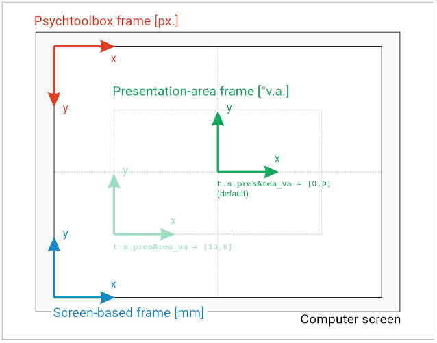
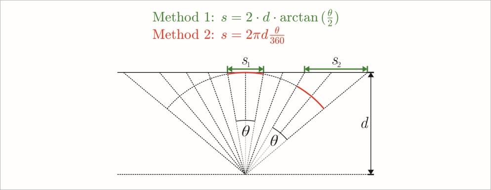
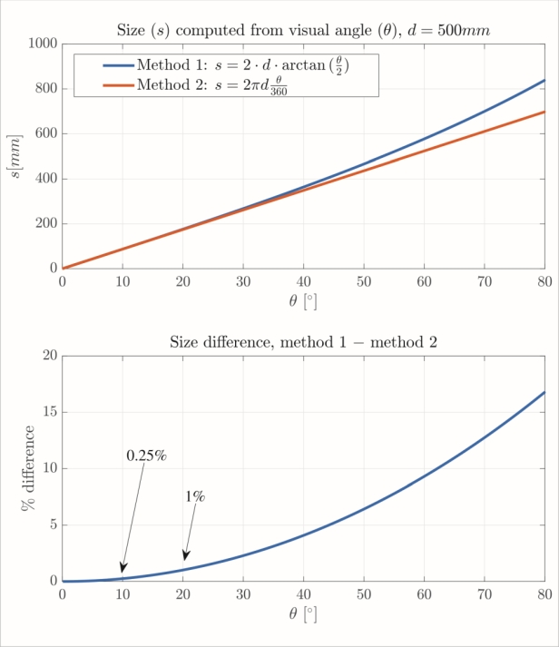

# Experiment Template for MATLAB & Psychtoolbox 3

This template is designed to speed up the development of psychophysics experiments with MATLAB and Psychtoolbox 3. It handles some common aspects of experiment scripts, such as loading a list of trials, reading data from it, presenting  instructions, iterating over trials, generating and saving a table of results, and converting between different spatial reference frames and units to interface between stimulus specification and Psychtoolbox drawing functions (e.g., millimeters, degrees of visual angle, and pixels).

* [Overview](#overview)
* [Input / output of trial generation and experiment code](#input--output-of-trial-generation-and-experiment-code)
	* [Trial generation: struct `t`](#trial-generation-struct-t)
	* [Experiment: struct `e`](#experiment-struct-e)
	* [Accessing trial properties within the experimental code](#accessing-trial-properties-within-the-experimental-code)
* [Directory structure](#directory-structure)
* [File execution order](#file-execution-order)
* [What does each file do?](#what-does-each-file-do)
* [Trial generation](#trial-generation)
	* [Specifying positions and sizes](#specifying-positions-and-sizes)
*  [Spatial reference frames and units](#spatial-reference-frames-and-units)
*  [Using `convert` to convert between units and coordinate frames](#using-convert-to-convert-between-units-and-coordinate-frames)
	* [Method reference](#method-reference)
	* [A note about visual angle conversion](#a-note-about-visual-angle-conversion)
* [Other built-in functionality](#other-built-in-functionality)
	* [Reserved field names in `t.s` (and `e.s`)](#reserved-field-names-in-ts-and-es)                       
	* [Color fields in `e.s` or `t.s.`](#color-fields-in-es-or-ts)
	* [Pre-existing variables in experimental code files](#pre-existing-variables-in-experimental-code-files)
	* [Reusable script files](#reusable-script-files)
	* [Helper functions](#helper-functions)
	* [Pre-existing anonymous functions in experimental code files](#pre-existing-anonymous-functions-in-experimental-code-files)
		* [getMouseRM()](#getmouserm)
	* [Pausing an experiment](#pausing-an-experiment)
	* [Debugging capabilities](#debugging-capabilities)
	* [Completing an interrupted session using  `resumeExperiment.m`](#completing-an-interrupted-session-using--resumeexperimentm)
	* [Setting mouse speed beyond what the OS permits](#setting-mouse-speed-beyond-what-the-os-permits)


## Overview

Roughly, a typical work flow to implement an experiment is as follows:
* **Create a new project** in your github for the new experiment. Do this by pressing the "Use this template" button, not by forking. Having a fresh independent repo will keep each experiment's code separate from the origin, making sure it won't be affected by later updates. The experiment can thus be replicated later in the exact same form at any time.
* **Create a list of trials**: Go to `template/trialGeneration/trialGeneration.m`. Write some code that creates a list of trials with properties for each trial, define some paradigm-level settings, and save both in a file. Put that file into `template/experiment/myTrials`. 
* **Specify your experiment**. Go to `template/experiment/myParadigmDefinition`. The files there will be run in sequence as numbered when the experiment is executed. Write code in each file to specify what happens in the corresponding step in your experiment.
* **Adjust settings** in `template/experiment/basicSettings.m` to you hardware and requirements.

Each file intended to be modified by you has extensive documentation of what kind of code to write in the file and of built-in mechanisms accessible at that point. There is also some example code in the files in `template/experiment/myParadigmDefinition`. Together that code implements a simple toy experiment (which should run right away when executing `runExperiment.m`). You can simply delete that code if you don't need it anymore. There are also `aboutThisFolder.md` files in many folders, that summarize the purpose of files in the folder and tell you whether or not you should modify or use them. 

The general idea is that you only modify/add files in
* `myParadigmDefinition` (only modify, don't add files)
* `myCustomFiles` (add custom functions etc., is added to MATLAB path for duration of experiment)
* `myTrials` (put your trial files here)
* in addition, you should adjust settings in `basicSettings.m`.

## Input / output of trial generation and experiment code

In short, trial generation must output a `*.mat` file containg a struct `t` holding settings and a trial list. The experimental code loads that file, executes the trials in the list, and in turn outputs a `*.mat` file that contains a struct `e` which holds settings and a list of results. Here are the details:

### Trial generation: struct `t`

The *.mat file created in trial generation must contain a struct `t` with fields
* `t.s`, with sub-fields that specify any paradigm-level settings (e.g., for maximum allowed response time you could define a field `t.s.maxResponseTime = 1000`). It's up to you how you use these settings in your experimental code. There are however some reserved field names with built-in functionality (described [here](#reserved-field-names-in-ts-and-es).
* `t.triallist`, a MATLAB table object. Each row holding one trial and columns corresponding to trial properties, such as stimulus positions or colors. It is again up to you how the experimental code uses what is stored in the table, except for a few reserved column names with built-in funtionality (see below).

### Experiment: struct `e`

The trial file created in trial generation is loaded into the experiment script. The information in `t` is transferred to struct `e` (after that `t` is not used/available in the experiment code). Struct `e` is used throughout the experiment and will be stored in the result file when the experiment is completed. It has the following fields:

* `e.s`, with the same sub-fields as `t.s`, plus any sub-fields defined in `basicSettings.m` or `s1_customSettings.m`.
* `e.results`, which contains a MATLAB table in which each trials' results are recorded (documentation in s5c_presentTrial.m` describes how to specify what should be stored as a result), each row corresponding to one trial presentation. All trial properties contained in the triallist are carried over to the results table as well (as columns of the same name). 

Note: I haven't gotten around to adjusting existing analysis scripts to the format of data in struct `e` (so far they used numeric or cell arrays). So for now you have to create your own analysis pipeline. 

### Accessing trial properties within the experimental code

* Within the experimental code contained in files in `/myParadigmDefinition` the trial list is accessible simply as the variable `triallist`.
*  Within the trial loop (files `/myParadigmDefinition/s5...`) properties of the current trial are also directly available through `currentTrial` (a one-row table). Also, the row number of the current trial *in the trial list* is available as `curTrialNumber`. Note that this is not necessarily the row number in the result list `e.results`, because trials might get repeated under certain circumstances and each repetition will be recorded in the results list. 


## Directory structure 
Here's an overview of the directory structure with notes on each folder's / file's purpose.
```
template
|
+-- experiment
|	|
|	+-- infrastructure            <-- things used internally, don't modify! 
| 	|	|
| 	|	+-- helperClasses         <-- might be useful beyond internal use
| 	|	+-- helperFunctions       <-- might be useful beyond internal use
| 	|	+-- internalScripts       <-- purely internal
| 	|	+-- reusableScripts       <-- might be useful beyond internal use
|	|
|	+-- myCustomFiles             <-- store any custom files here
|	+-- myParadigmDefinition      <-- add code in existing files
|	+-- myTrialFiles 	      	  <-- put trial files here (*.mat)
|	basicSettings.m 		      <-- only adjust values, dont modify code
|	runExperiment.m 			  <-- run to execute experiment
|   resumeExperiment.m 			  <-- run to finish an incomplete result file
|
+-- trialGeneration 		      
|	trialGeneration.m             <-- add code that generates trial file
|
+-- results 				      <-- to store results 
```

## File execution order

Start by running `runExperiment.m` or `resumeExperiment.m`. Files are then executed in the order listed below (these are all located in ```/myParadigmDefinition```, except for `basicSettings.m`) . Under the hood additional scripts are run in between, but this need not bother us. If you must, check out ```/experiment/infrastructure/internalScripts/callExpComponentsInOrder.m``` to see the full sequential structure.
```
basicSettings.m
s1_customSettings.m
s2_defineOffscreenWindows.m
s3_drawStaticGraphics.m
s4_presentInstructions.m
	s5a_blockBreak.m                |
	s5b_drawChangingGraphics.m      | loop (one iteration per trial)
	s5c_presentTrial.m              |
s6_presentGoodbye.m
```

## What does each file do?

+ `basicSettings.m`
**It is vitally important to set up this file correctly!** It's a bunch of settings needed for every experiment that is based on this code, mostly hardware-related things. More specifically, this contains settings that you might have to change halfway through participants, say because you move over to a different computer (think screen size and such). (Settings that do apply globally to the paradigm but that are intended to be consistent across participants should instead be specified during trial generation.)


* `runExperiment.m`                      
Don't modify this, just run it to start the experiment. The code takes care of adding the existing subdirectories of ```/experiment/``` to the MATLAB path for the duration of the experiment and then calls the rest of the experimental code.

* `resumeExperiment.m`                      
Similar to `runExperiment.m` (in fact, it calls that function) but you won't be asked for a trial file, but for an incomplete result file, thus allowing to resume experimental sessions that have been interrupted.

* `s1_customSettings.m`
Similar to ```basicSettings.m```, but for additional settings required in your own, custom experiment, such as properties of some piece of special hardware.  The idea is to put only things here that you might have to adjust at some point. Do **not** put settings here that are vital to be consistent over participants (e.g., presentation times); these should be fixed in the trial file.

* `s2_defineOffscreenWindows.m`
Open as many offscreen windows as you need. It's basically a one-liner, due to built-in functionality documented in the file.  In any following code, the windows will be accessible through struct `offWins`.  (Psychtoolbox uses the concept of offscreen windows. Each window is  basically a canvas onto which you can draw something but without showing it on the screen yet. Only when you want to display it on the screen, you copy the offscreen window to the "onscreen window". Drawing in advance can improve presentation timing later. Drawing happens only in the next file, though.)

* `s3_drawStaticGraphics.m`
This file is for drawing graphics that do not change over trials and are reused in multiple trials, such as a fixation cross.  Draw graphics to the prepared offscreen windows. 

* `s4_presentInstructions.m`
Do anything you like before any trials are presented. Typically used to display instructional text or other things that the participant needs to see beforehand. 

* `s5a_blockBreak.m`
*This file is part of the trial-loop*. It is potentially executed once at the outset of each trial. However, this particular file is executed only when block number changes and some other conditions are met, see below. Typically used to implement breaks for the participant between blocks. Conditions for execution are:

	* `e.s.useTrialBlocks` is `true`. Set it as `t.s.useTrialBlocks` in `trialGeneration.m`. This setting	determines whether trials are organized into blocks. Which block a trial belongs to must be indicated in a column `t.triallist.block`. More details [here](#t.s.usetrialblocks).  
	* The block number of the current trial is different from that of the previous trial. 
	* The number of the current trial's block is in the array in `t.s.breakBeforeBlockNumbers`. If `tg.s.breakBeforeBlockNumbers` was not specified, the default is to run `s5a_blockBreak.m` before each block except the first one. Details again [here](#t.s.usetrialblocks).  

* `s5b_drawChangingGraphics.m`
*This file is part of the trial-loop*. It is executed once each trial. For drawing graphics that change between trials (i.e., stimuli), to the prepared offscreen windows. 

* `s5c_presentTrial.m`
*This file is part of the trial-loop*. It is executed once for each trial. Here you freely specify everything that happens in a trial, such as a start phase (say, moving the cursor to a start position), stimulus presentation (e.g., showing multiple visual targets), response collection (such as clicking on the correct target or pressing a button), and feedback to the participant. In the course of your trial code you can create fields in the pre-existing struct `out` at any time. Any data that is present in a field of `out` when the trial ends will be stored in a correspondingly named column of the results table (`e.results`). You can store any type of data that way.

* `s6_presentGoodbye.m`
This file is executed once after all trials, just before the experimental script exits. Typically used to display a goodbye message or gather post-experiment questionnaire data . 

## Trial generation

Please see the example code in `trialGeneration.m` to get an idea how to go about this. Essentially, as described [above](#trial-generation-struct-t), all you need to do is specify a trial list (`t.triallist`) in the form of a MATLAB table, and some paradigmn-level settings (in sub-fields of `t.s`), save struct `t` to a `*.mat` file, which can later be loaded by the experimental code. You are essentially free in how to do all this, what columns to define in the trial list, and what sub-fields of `t.s`, since when you write the experimental code that uses all these data, it is basically up to you what to do with it. There are just a few reserved field names of `t.s.` with built-in functionality (listed [here](#reserved-field-names-in-ts-and-es)). Take a look at these, they might prove useful!

As concerns paradigm-level settings in `t.s`, the idea is to **specify all those non-trial-specific properties of the paradigm already during trial generation that you want to remain consistent across participants**. Having these settings fixed in the trial file prevents them from being changed accidentally when you're halfway through participants. (While the files `basicSettings.m` and `s1_customSettings.m` are intended to add further settings, these are meant for settings that you might need to change between participants, say, due to switching screens or using a new mouse).

### Specifying positions and sizes

Here as well you are free in what to do **but my recommendation is to specify locations and distances within the presentation-area-coordinate-frame and in degrees of visual angle**.  As described [here](#spatial-reference-frames-and-units), the origin of that coordinate frame is in the screen center by default, the x-axis points right, and the y-axis points upward.

The reason is two-fold: (1) Degrees of visual angle are the decisive measure in most contexts of visual psychophysics and, more importantly, (2) it makes it easy to migrate the experiment to different screens or to change other aspects of the spatial setup, such as viewing distance, without changing the perceptual size of visual stimuli to the participant (as long as you properly adjust `basicSettings.m` to the new situation!).

A drawback is that both that reference frame and those units are completely different from what Psychtoolbox functions expect as input (described [here](#spatial-reference-frames-and-units)). However, it is easy to convert to the Psychtoolbox frame by using the variable `convert` that can be accessed in the experimental code (it's an object of the `CoordinateConverter` class). Just as a quick heads-up (details TODO): Say you specified x,y stimulus coordinates relative to the presentation-area-frame origin and in visual angle, and you are now writing experimental code. You can convert the location data to the Psychtoolbox frame and pixel units by simply invoking the appropriate method of `convert`:
```MATLAB
xy_converted = convert.paVa2ptbPx(xy(1), xy(2));  
```
You can then pass the conversion result to a Psychtoolbox function to, say, draw a stimulus at that position.

Finally, some things and settings make sense only in millimeters or pixels. For instance, if you use a motion capturing system to track hand position relative to the screen, then the z-axis (distance from screen surface) cannot be sensibly expressed in degrees of visual angle. If you have to specify a location along that axis, e.g., a 3D position where the hand has to go before each trial, you'll probably do it in millimeters. No problem. Anyway, I suggest postfixing field or column names with units in such cases, to disambiguate which units you used for a given property or setting (I use postfixes `_va` for visual angle, `_mm`, and `px`).


## Spatial reference frames and units

There are three coordinate reference frames (CRF) relevant here (see figure below). But don't worry, you mostly only need to think in the **presentation-area frame**, as all positions for drawing and similar things should be specified in that frame. The second one is the **Psychtoolbox frame** which Psychtoolbox functions expect spatial locations to be supplied in. The third is the **screen-based frame** which is meant for working with motion capturing equipment, so you don't need to worry about that one if you don't do that. In any case, converting between these frames and between units (millimeters, pixels, degrees of visual angle) is made easy by an object of the class `CoordinateConverter` that is available in the experimental code through the variable `convert`. That object provides various methods for conversion.

Here's an illustration of each coordinate frame. Note that optionally the presentation-area frame's origin can be shifted by setting `t.s.presArea_va` during trial generation, but it is in the screen center by default (and that should usually be the most convenient setup). More details on the three frames below.



* *__Presentation-area-based frame (pa):__* It's recommended to use this frame for all input to and also for output from the experimental script, in conjunction with degrees of visual angle (va) as units (as far as that makes sense). Its origin is at the bottom left of the presentation area, the x-axis increases to the right, and the y-axis increases upward.  The "presentation area" is an imagined rectangle centered within the screen whose horizontal and vertical side lengths are set during trial generation through `t.s.presArea_va` (in degrees of visual angle). The default is [0,0], which means that the origin of the presentation area is in the screen center. Since the region is always centered within the screen, increasing the side lengths amounts to shifting the origin to the left and downward (e.g., [10,6] means that the origin will be 5° to the left and 3° below the screen center). Since defined in visual angle, the presentation area will change its actual size depending on viewing distance and its pixel size depending on the display resolution (both need to be set correctly in `basciSettings.m`!).

* *__Psychtoolbox frame (ptb):__* Psychtoolbox functions expect data in that coordinate frame and in pixel units. It is used only in the internals of the experimental script and when drawing to Psychtoolbox windows. The origin is at the top left of the screen, x-axis increasing to the right, y-axis increasing downward. When using Psychtoolbox functions, use conversion
functions (see next section) to convert any data to this frame first. Note that Psychtoolbox output like mouse position from functions like `GetMouse` are also in this frame. To map these back to other frames and/or units you can as well use
conversion functions.

* *__Screen-based frame (scr):__* Origin at bottom left of the visible image of the screen, x-axis increasing to the right, y-axis increasing upward. This frame is intended for use with motion tracking equipment. The idea is to have tracking markers mounted on the screen and assess other markers' positions within a coordinate frame defined by those mounted markers. The markers should be mounted such that the coordinate frame is congruent with the screen-based frame, thus enabling usage of this class to convert from marker positions as returned by the motion tracking equipment to the other frames (e.g., for drawing a pointer on the screen or recording trajectories in relation to stimuli).

## Using `convert` to convert between units and coordinate frames

**IMPORTANT: The accuracy of conversion depends on the correctness and precision of the values in `basicSettings.m`! These need to be adjusted to your hardware and spatial setup as accurately as possible and must be updated when these change.**

The variable `convert` is in the work space when the experimental script executes the files in `/myParadigmDefinition` so that it can be referenced by the code in these files. It contains an object of the class `CoordinateConverter`, which provides various methods for conversion between units and between reference frames. The goal of this class is to enable the user to think (almost) exclusively in degrees of visual angle and within the presentation-area-based coordinate frame when specifying stimuli and such, while easily converting to the Psychtoolbox frame to use Psychtoolbox functions in the experimental code. Note that the object in `convert` is stored in the final result file as `e.s.coordinateConverter` to enable frame and unit conversions during later data analysis as well.

There are two types of methods: **unit-conversion-methods** and **unit-coordinate-frame conversion methods**.

#### Unit-conversion-methods
Convert between units. They expect a numeric array as input and return an array of the same size holding converted values. Example:
```MATLAB
>> foo = magic(3);
>> convert.mm2px(foo)

ans =

    26     3    19
    10    16    23
    13    29     6
```

#### Unit-coordinate-frame conversion methods
Convert from one coordiunate frame to the other and at the same time from one type of units to the other (since it is mostly useful to do this in one go). They take two input arguments, namely two vectors of length n, which hold the x and y coordinates of n points, respectively. They return a 2-by-n matrix with converted x and y coordinates in its rows, for each of the n points. Arrays of this format can be passed directly to most Psychtoolbox functions. Example:
```MATLAB
>> x_paVa = 2;	  % in presentation area frame & deg. visual angle
>> y_paVa = 1.5;  % in presentation area frame & deg. visual angle
>> xy_ptbPx = convert.paVa2ptbPx(x_paVa,y_paVa)  % output in Psychtoolbox frame and pixels

xy_ptbPx =

        1354
         487
```

### Method reference

#### Naming scheme

The methods are all named according to the same scheme, using the same abbreviations for units and frames:

* **va**  : degrees of visual angle
* **mm** : millimeters
* **px**  : pixels
* **pa**  : presentation-area coordinate frame
* **ptb** : Psychtoolbox coordinate frame
* **scr** : screen-based coordinate frame

E.g., `convert.paMm2ptbPx` converts from millimeter coordinates given in the presentation-area-based frame to pixel coordinates in the Psychtoolbox frame and `convert.va2px` converts from degrees of visual angle to pixels.

#### List of methods
```
px2mm
va2mm
mm2px
va2px
mm2va
px2va

paMm2ptbPx
paVa2ptbPx
ptbPx2paMm
ptbPx2paVa
scrMm2paMm
scrMm2ptbPx
```

### A note about visual angle conversion 

The method to do calculations with visual angle and the conversion to other units by `CoordinateConverter` is slightly different from the standard way. In short, the method used here does not account for eccentricity, as explained in detail in the following.

The method mostly used to convert between visual angle and sizes or distances on a flat screen is Method 1 in the figure below (where *d* is viewing distance, *s* is stimulus size or distance, and *theta* is the visual angle in degrees). This method is exact insofar that stimulus sizes or distances between stimuli depend on eccentricity, as can be seen from the different lengths of the green lines in the figure. It is however often not clear when people provide stimulus sizes or distances whether they computed them as if the stimulus was in the center of vision, or whether they accounted for its eccentricity (looking at the literature, that does not appear to be the case in most instances). 

In the template code I instead use Method 2, which computes size or distance *s* as the length of the arc with radius *d* that  corresponds to *theta*. As can be seen from the red lines in the figure, there is a constant relationship between angle and size with this method. I use this method instead of the standard one to be able to use degrees of visual angle as units in the coordinate system in which stimuli locations and sizes are defined.

The results of the two methods differ somewhat, and this difference increases with the visual angle, eccentricity, or stimulus size at hand. However, for all practical stimulus sizes and distances that may appear in most experiments, the difference between the methods is negligibly small. The bottom figure shows the difference for different values of visual angle, to help decide whether the difference is relevant for your particular experiment.






## Other built-in functionality

Note that apart from the functionality listed here, some additional functions are documented only in the experimental code files where they may become relevant.

### Reserved field names in `t.s` (and `e.s`)

There is a number of field names in these two structs that have predefined functionality. **These are meant to be set during trial generation** (though it is possible to define them during the experiment, it is not recommended). Defining any of these fields is **OPTIONAL**. The default behavior for undefined fields is indicated below. If a field *is* defined, however, it should be used only for the intended functionality (in other words, don't use these field names for custom purposes or something might break). So, here are the fields:

#### `t.s.experimentName`
Assign a string. That string will be appended to the results file name automatically. Default if undefined is an empty string.
 
#### `t.s.useTrialBlocks`       
Assign Boolean. Determines whether trials are blocked. Default if undefined: `false`. If `true`, the following applies:
* Each trial in `t.triallist` must be marked as belonging to one block. For this, define a column `t.triallist.block`; it must contain integers that identify the block number for each trial. Arbitrary integers may be used but each block must have a unique number and all trials with the same number must be in consecutive rows.                
* Any code in `s5a_blockBreak.m` will be executed before each block but the first. Optionally, this can be further controlled by defining `t.s.breakBeforeBlockNumbers` and assigning to it an array of block numbers. `s5a_blockBreak.m` will then be executed only before the specified blocks (this may include the first one).
* Any trial shuffling will occur only within and not across blocks (see `t.s.shuffleTrialOrder`), that is, block order is preserved.

#### `t.s.shuffleTrialOrder`
Assign Boolean. Default if undefined: `false`. If `true`, the order of trials in the triallist will be shuffled at the outset of the experimental script, so that each participant sees a different trial order. If blocks are enabled (see `t.s.useTrialBlocks` above), shuffling will occur only within blocks.     

#### `t.s.shuffleBlockOrder`
Assign Boolean. Default if undefined: `false`. If set to true, the order of blocks in the triallist will be shuffled at the outset of the experimental script, so that each participant will see a different block order. Only comes to effect if blocks are enabled (see `t.s.useTrialBlocks` above).

#### `t.s.bgColor`
Assign RGB triplet ([0,0,0] to [1,1,1]). Default background color for all Psychtoolbox windows. Can also be one of the strings 'black', 'white', or 'grey' (in which case it is converted to an RGB triplet, see [here](#Using-strings-black-white-or-grey-in-es-or-ts-field-names)). Default if undefined: 'grey'.
                                        
#### `t.s.onscreenWindowTextFont`
Assign string. Default if undefined: 'Arial'. Default font for text in onscreen window. 

#### `t.s.onscreenWindowTextHeight_va`
Default font height for onscreen window in degrees of visual angle. Default if undefined: 0.75.                                

#### `t.s.desiredMouseScreenToDeskRatio`

Setting this makes available an anonymous function `getMouseRM()` in the experimental code that returns mouse cursor location and allows setting mouse cursor speed.  See [getMouseRM()](#getmouserm).

#### `t.s.presArea_va`
Assign a two-element row vector, giving the horizontal and vertical extent of the presentation area (explained [here](#presentation-area)) in degrees of visual angle. Default if undefined: [0,0], meaning that **the origin of the presentation area will be in the screen center by default**. Basically, changing this moves around the origin of the coordinate system in which it is recommended to specify positions during trial generation.                                       

### Color fields in `e.s` or `t.s.`

For any field name in `e.s` (and by extension in `t.s`) that ends with "Color" (e.g. `t.s.stimulusColor`) it will be checked whether that field contains any of the strings `black`, `white`, or `grey`. The string will be replaced by the corresponding color value from the Psychtoolbox color lookup table (where grey is white/2).

### Pre-existing variables in experimental code files

The documentation at the top of each file in  `template/experiment/myParadigmDefinition/` includes a list of variables that pre-exist in the workspace when the experimental script arrives at that file. These variables can thus be referenced and used in the respective file and include things like the current trial number, the struct `out` to store output data in, or `e.s`, the struct holding all paradigm-level settings. 

### Reusable script files

Found under `template/experiment/infrastructure/reusableScripts`. These are used internally but each of them can simply be called by its file name (omitting the m-extension) within the experimental code. Just take a look at the files, they have speaking names and a brief documentation each.

### Helper functions

A bunch of helpful functions under `template/experiment/infrastructure/helperFunctions` that are used internally but can also be called in experimental code. Just take a look at the files, most of them are well documented.

### Pre-existing anonymous functions in experimental code files

These are functions that are defined before any of the editable experimental code files are run and that can thus be called in the experimental code. So far, there is only one:

#### getMouseRM()

Call `xy = getMouseRM()` within the experimental code to get the current mouse position, but remapped to accord to a desired mouse speed. For instance, you may want the mouse cursor to move 10 millimeters on the screen when the mouse moves 10 millimeters on the desk (1:1 mapping). You should call this in a loop and plot a cursor to the onscreen window each iteration at the position returned by the function (returned values are in presentation-area frame and degrees of visual angle). **This anonymous function is available only if the following fields exist in `e.s`**:

* `e.s.desiredMouseScreenToDeskRatioXY`. Define this settings during trial generation as `t.s.desiredMouseScreenToDeskRatioXY`. This is the mapping you *want* to have. For instance, if you want the cursor to move 20 millimeters when the mouse is moved 10 millimeters, set this to 2. 
* `e.s.rawMouseScreenToDeskRatio`, defined in `basicSettings.m`. This is the *true* mapping *before* applying the remapping, that is, the mouse speed that arises from OS settings. The correct value for this setting can be determined by running `getMouseScreenToDesk()` (located in `/experiment/infrastructure/helperFunctions/mouseInput/`), which will lead you through a calibration procedure. But no worries, you need to calibrate only once for each experiment (but see the following note!). **IMPORTANT: When you switch hardware or change mouse speed in OS settings you MUST rerun the calibration procedure and update the value!!! Also, DISABLE MOUSE ACCELERATION IN THE OS SETTINGS. Both of these things are absolutely vital for mouse tracking precision.**

Note that `getMouseRM()` is simply a wrapper for `getMouseRemapped()` which can be found in `/experiment/infrastructure/helperFunctions/mouseInput/`. See that function for more documentation.

### Pausing an experiment

You can pause an experiment by holding the pause button at the start of a trial (typically, you need to start pressing before a trial ends). Psychtoolbox windows will close and a message box pop up with options to resume, abort, or debug (see below). If you choose to abort you can later resume the experiment using the incomplete result file (see below).

### Debugging capabilities

There are a few debugging capabilities that are particularly useful when dealing with the notoriously unwieldly Psychtoolbox windows – due to which many a good codesmen have been lost in the abyss of the task manager. In other words, these features take care of closing the windows and reopening them after debugging (as well as re-drawing any graphics), so that you can pause, examine the workspace or change variables, and then resume the experiment.

* `breakToDebug;` can be included in any file after `runExperiment`. It will close PTB windows and return to the MATLAB prompt without terminating the experiment function. Execution can be resumed as with any break point (F5). 

* `debugOnError` is a setting optionally defined in `basicSettings.m`. If defined and `true`, any error in the experimental scripts will invoke `breakToDebug`.

* Finally, the message box invoked by pausing the experiment manually (hold pause key at the start of a trial) has an option which allows to go to the prompt for debugging.

### Completing an interrupted session using  `resumeExperiment.m`

Say your triallist has 1000 trials, but the computer crashes after 800. Fortunately, the experimental script routinely saves and updates a preliminary result file in the selected save folder. That file is usually removed and replaced by the final file upon experiment completion, but is retained if the experiment is interrupted. It will be named something like `ptsNumber_myExperiment.mat.incomplete`. To run the pending trials, execute `resumeExperiment.m`. It will ask for an `*.incomplete` file instead of a trial file, and simply finish the remaining trial list exactly as if the interruption never happened. Should there be another interruption during the new session, the ```*.incomplete``` file will have been updated with the new trials and you can resume from there again. Upon completion of the experiment, the final result file will be created as usual and the incomplete file is deleted. There will however be a backup copy of the incomplete file before the update in the same folder, which you can delete manually.

**Warning:** Values in `e.s` set in `basicSettings.m`, `s1_customSettings` or later override what is stored in the resumed file and what will be saved. This is intended behavior, as it allows to finish an incomplete session on different hardware and therefore different settings. However, if you have to do this, be wary about using ```e.s.convert``` during later analysis to convert units, as ```e.s.convert``` stored in the final result file will be based on the *new* settings, and might thus not be valid for the older batch of trials. The best workaround for this is to routinely do all necessary conversions already when recording results during the experiment, so that you don't need to do any conversions during analysis. 

### Setting mouse speed beyond what the OS permits

See [getMouseRM()](#getmouserm).


